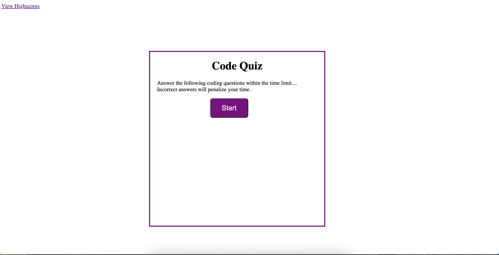

This is a timed coding quiz to test your knowledge on JavaScript.
Scores and initials are recorded.
The quiz consists of 5 multiple choice questions, with 60 seconds on the clock.
For every wrong answer selected, 10 seconds will be taken off the clock.
The final score is the amount of seconds remaining on the clock once the quiz is completed.

link to deployed application:
https://surfinsofia.github.io/codingQuiz/

